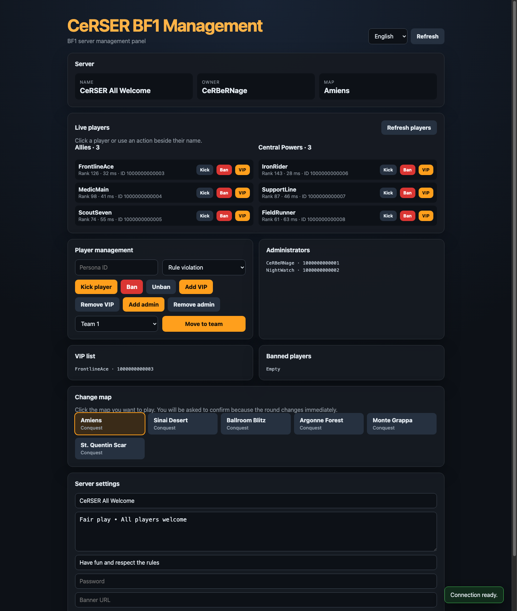

<div align="center">

# CeRSER BF1 Server Manager

A simple, dependency-free, multilingual Battlefield 1 RSP management panel.

[Türkçe](README.md) · [English](README.en.md) · [Русский](README.ru.md) · [中文](README.zh-CN.md)




</div>

## Features

- Live server, map, and player information
- Kick, ban, VIP, and administrator list actions
- Move players between teams
- Change the current round by clicking a map
- Edit the server name, message, description, banner, and advanced settings
- Toast notifications and confirmation prompts for critical actions
- Turkish, English, Russian, and Chinese interface
- Browser-specific sessions with no credentials written to disk

## Requirements

- Node.js 20 or newer
- An EA account with the required RSP permissions for the Battlefield 1 server
- A valid EA `SID` from your own account; `REMID` is optional

## Installation

```bash
npm install
npm start
```

Open `http://127.0.0.1:8787`. No `.env` file is required. Enter your SID in the connection dialog shown on first use.

Run the checks with:

```bash
npm test
```

## Finding your SID

1. Sign in to your EA account in your browser.
2. Open Developer Tools and go to **Application → Cookies → `https://accounts.ea.com`**.
3. Copy the `sid` value into the panel. Add the `remid` value only when needed.

SID and REMID are sensitive session credentials that may provide access to your EA account. Use them only on a deployment you operate or trust. The panel never writes these values to disk; it keeps them in server memory for a browser-specific 12-hour session. Restarting the application clears all in-memory sessions.

## Server configuration

The target BF1 server `GAME_ID` is defined near the top of `index.js`. Change it to use the panel with another server. The default local port is `8787`.

## Publishing on the internet

The application uses `127.0.0.1` locally and accepts external connections when the hosting environment supplies `PORT`. Provide HTTPS and preserve the `Host` and `X-Forwarded-Proto` headers when using a reverse proxy. Never publish a deployment that accepts SID/REMID over unencrypted HTTP.

### Bonto

Connect the repository to Bonto or upload the files. Bonto detects `package.json` and runs `npm install` followed by `npm start` automatically. Do not upload `node_modules`; this project has no external runtime packages, so the folder may not be created at all. The application automatically uses the `PORT` assigned by Bonto. See the [Bonto Node.js guide](https://bonto.dev/hosting/nodejs) for details.

## Disclaimer

This is an independent community project and is not affiliated with Electronic Arts or DICE. The BF1 Companion/RSP endpoints are not a stable, documented public API, so changes made by EA may break individual features.
