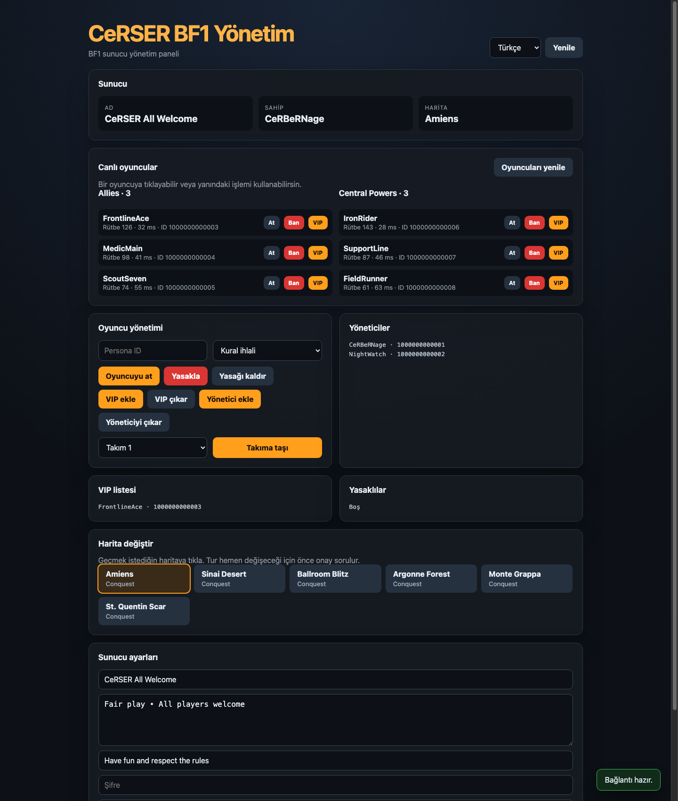

<div align="center">

# CeRSER BF1 Server Manager

Basit, bağımlılıksız ve çok dilli Battlefield 1 RSP yönetim paneli.

[Türkçe](README.md) · [English](README.en.md) · [Русский](README.ru.md) · [中文](README.zh-CN.md)

### [Canlı demoyu aç](https://cerserbf1.bonto.run/)




</div>

## Özellikler

- Canlı sunucu, harita ve oyuncu bilgileri
- Oyuncu atma, yasaklama, VIP ve yönetici listesi işlemleri
- Oyuncuları takımlar arasında taşıma
- Haritaya tıklayarak tur değiştirme
- Sunucu adı, mesajı, açıklaması, banner ve gelişmiş ayarlar
- Toast bildirimleri ve kritik işlemler için onay pencereleri
- Türkçe, İngilizce, Rusça ve Çince arayüz
- Diskte kimlik bilgisi saklamayan tarayıcıya özel oturum

## Gereksinimler

- Node.js 20 veya üzeri
- Battlefield 1 sunucusunda gerekli RSP yetkisine sahip bir EA hesabı
- Hesabınıza ait geçerli EA `SID`; `REMID` isteğe bağlıdır

## Kurulum

```bash
npm install
npm start
```

Paneli `http://127.0.0.1:8787` adresinde açın. `.env` dosyası gerekmez. İlk bağlantıda açılan pencereden SID değerini girin.

Testleri çalıştırmak için:

```bash
npm test
```

## SID nasıl bulunur?

1. Tarayıcınızda EA hesabınıza giriş yapın.
2. Geliştirici araçlarını açın ve **Application / Uygulama → Cookies → `https://accounts.ea.com`** bölümüne gidin.
3. `sid` değerini kopyalayıp paneldeki SID alanına yapıştırın. Gerekirse `remid` değerini de ekleyin.

SID ve REMID, EA hesabına erişim sağlayabilen hassas oturum bilgileridir. Bunları yalnızca kendinizin yönettiği veya güvendiğiniz bir kurulumda kullanın. Panel değerleri diske yazmaz; sunucu belleğinde, tarayıcıya özel olarak 12 saat tutar. Uygulama yeniden başlatıldığında bellekteki oturumlar silinir.

## Sunucu yapılandırması

Yönetilecek BF1 sunucusunun `GAME_ID` değeri `index.js` dosyasının başında tanımlıdır. Başka bir sunucuyla kullanmak için bu değeri değiştirin. Varsayılan yerel port `8787` değeridir.

## İnternette yayınlama

Uygulama yerelde `127.0.0.1` üzerinde çalışır; barındırma ortamı `PORT` verdiğinde dış bağlantıları kabul eder. İnternette kullanırken HTTPS sağlayın ve reverse proxy kullanıyorsanız `Host` ile `X-Forwarded-Proto` başlıklarını koruyun. SID/REMID kullanılan bir kurulumu şifresiz HTTP üzerinden yayınlamayın.

### Bonto

Depoyu Bonto'ya bağlamanız veya dosyaları yüklemeniz yeterlidir. Bonto `package.json` dosyasını görerek `npm install` ve `npm start` komutlarını otomatik çalıştırır. `node_modules` klasörünü yüklemeyin; bu projede harici çalışma zamanı paketi olmadığı için klasörün oluşmaması normaldir. Uygulama Bonto'nun verdiği `PORT` değerini otomatik kullanır. Ayrıntılar için [Bonto Node.js rehberine](https://bonto.dev/hosting/nodejs) bakın.

## Uyarı

Bu proje topluluk tarafından geliştirilmiş bağımsız bir araçtır; Electronic Arts veya DICE ile bağlantılı değildir. BF1 Companion/RSP uçları resmi ve kararlı bir genel API değildir, bu nedenle EA tarafındaki değişiklikler bazı özellikleri bozabilir.
