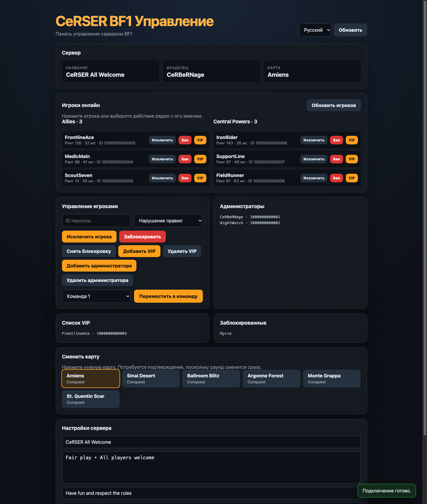

<div align="center">

# CeRSER BF1 Server Manager

Простая многоязычная панель управления Battlefield 1 RSP без сторонних зависимостей.

[Türkçe](README.md) · [English](README.en.md) · [Русский](README.ru.md) · [中文](README.zh-CN.md)

### [Открыть демоверсию](https://cerserbf1.bonto.run/)




</div>

## Возможности

- Текущая информация о сервере, карте и игроках
- Исключение и блокировка игроков, управление списками VIP и администраторов
- Перемещение игроков между командами
- Смена текущего раунда нажатием на карту
- Изменение названия, сообщения, описания, баннера и расширенных настроек сервера
- Всплывающие уведомления и подтверждение критических операций
- Интерфейс на турецком, английском, русском и китайском языках
- Отдельная сессия браузера без записи учётных данных на диск

## Требования

- Node.js 20 или новее
- Учётная запись EA с необходимыми правами RSP на сервере Battlefield 1
- Действительный EA `SID` вашей учётной записи; `REMID` необязателен

## Установка

```bash
npm install
npm start
```

Откройте `http://127.0.0.1:8787`. Файл `.env` не нужен. При первом запуске введите SID в окне подключения.

Запуск проверок:

```bash
npm test
```

## Как найти SID

1. Войдите в свою учётную запись EA в браузере.
2. Откройте инструменты разработчика и перейдите в **Application → Cookies → `https://accounts.ea.com`**.
3. Скопируйте значение `sid` в панель. При необходимости добавьте значение `remid`.

SID и REMID — конфиденциальные данные сессии, которые могут предоставить доступ к вашей учётной записи EA. Используйте их только на сервере, которым управляете или которому доверяете. Панель не записывает эти значения на диск: они хранятся в памяти сервера в отдельной 12-часовой сессии браузера. Перезапуск приложения удаляет все сессии из памяти.

## Настройка сервера

Значение `GAME_ID` целевого сервера BF1 задано в начале файла `index.js`. Измените его, чтобы использовать панель с другим сервером. Локальный порт по умолчанию — `8787`.

## Публикация в интернете

Локально приложение использует `127.0.0.1`, а при наличии переменной `PORT` принимает внешние подключения. Обеспечьте HTTPS и сохраняйте заголовки `Host` и `X-Forwarded-Proto` при использовании reverse proxy. Не публикуйте панель, принимающую SID/REMID, через незашифрованный HTTP.

### Bonto

Подключите репозиторий к Bonto или загрузите файлы. Bonto обнаружит `package.json` и автоматически выполнит `npm install`, а затем `npm start`. Не загружайте папку `node_modules`: у проекта нет внешних runtime-зависимостей, поэтому эта папка может вообще не появиться. Приложение автоматически использует переменную `PORT`, назначенную Bonto. Подробности приведены в [руководстве Bonto по Node.js](https://bonto.dev/hosting/nodejs).

## Отказ от ответственности

Это независимый проект сообщества, не связанный с Electronic Arts или DICE. Конечные точки BF1 Companion/RSP не являются стабильным документированным публичным API, поэтому изменения со стороны EA могут нарушить работу отдельных функций.
