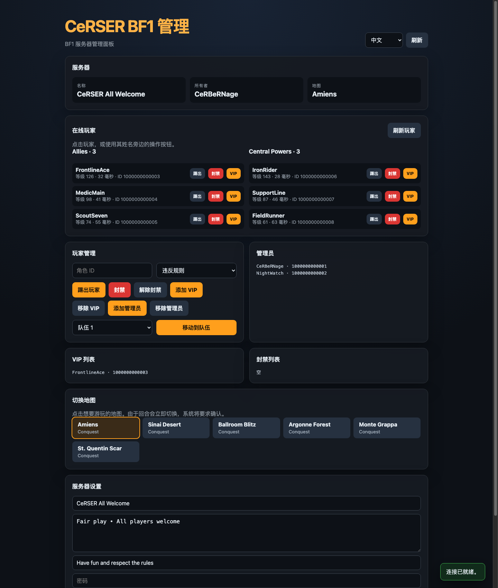

<div align="center">

# CeRSER BF1 Server Manager

一个简单、零运行时依赖、多语言的《战地 1》RSP 服务器管理面板。

[Türkçe](README.md) · [English](README.en.md) · [Русский](README.ru.md) · [中文](README.zh-CN.md)

### [打开在线演示](https://cerserbf1.bonto.run/)




</div>

## 功能

- 实时显示服务器、地图和玩家信息
- 踢出或封禁玩家，管理 VIP 和管理员列表
- 在队伍之间移动玩家
- 点击地图即可切换当前回合
- 修改服务器名称、消息、描述、横幅和高级设置
- Toast 通知以及关键操作确认
- 支持土耳其语、英语、俄语和简体中文
- 每个浏览器使用独立会话，凭据不会写入磁盘

## 要求

- Node.js 20 或更高版本
- 对目标《战地 1》服务器拥有相应 RSP 权限的 EA 账户
- 你自己账户的有效 EA `SID`；`REMID` 为可选项

## 安装

```bash
npm install
npm start
```

打开 `http://127.0.0.1:8787`。无需 `.env` 文件。首次使用时，请在连接窗口中输入 SID。

运行检查：

```bash
npm test
```

## 如何查找 SID

1. 在浏览器中登录你的 EA 账户。
2. 打开开发者工具，进入 **Application → Cookies → `https://accounts.ea.com`**。
3. 复制 `sid` 的值并粘贴到面板中。仅在需要时填写 `remid`。

SID 和 REMID 是敏感的会话凭据，可能提供对 EA 账户的访问权限。请仅在你自己管理或信任的部署中使用。面板不会将这些值写入磁盘；它们仅在服务器内存中保存，并与当前浏览器的 12 小时会话关联。重新启动应用会清除所有内存会话。

## 服务器配置

目标 BF1 服务器的 `GAME_ID` 定义在 `index.js` 文件顶部。若要管理其他服务器，请修改该值。默认本地端口为 `8787`。

## 发布到互联网

应用在本地使用 `127.0.0.1`；当托管环境提供 `PORT` 时会接受外部连接。请提供 HTTPS，并在使用反向代理时保留 `Host` 和 `X-Forwarded-Proto` 请求头。切勿通过未加密的 HTTP 发布需要输入 SID/REMID 的面板。

### Bonto

将仓库连接到 Bonto 或直接上传文件即可。Bonto 会检测 `package.json`，自动运行 `npm install`，然后运行 `npm start`。请勿上传 `node_modules`；本项目没有外部运行时依赖，因此该目录可能根本不会创建。应用会自动使用 Bonto 分配的 `PORT`。详情请参阅 [Bonto Node.js 指南](https://bonto.dev/hosting/nodejs)。

## 免责声明

这是一个独立的社区项目，与 Electronic Arts 或 DICE 无关。BF1 Companion/RSP 端点并非稳定且有正式文档的公共 API，因此 EA 的更改可能导致部分功能失效。
